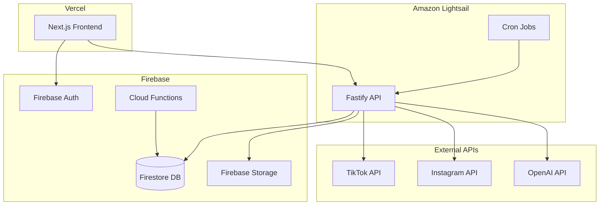

# Social Media Manager - Product Plan

## Tech Stack

- **Frontend**: Next.js 14+ (App Router) with TypeScript, deployed on **Vercel**
- **Backend API**: Fastify with TypeScript, deployed on **Amazon Lightsail**
- **Database**: **Firebase Firestore** (NoSQL document database)
- **Authentication**: **Firebase Auth** (email/password + OAuth providers)
- **File Storage**: **Firebase Storage** for media files
- **Background Jobs**: Firebase Cloud Functions + Cloud Scheduler for scheduled posts
- **AI**: OpenAI API (GPT-4) for content generation
- **UI**: Tailwind CSS + shadcn/ui components

## Architecture Overview



---

## Phase 1: MVP - Core Scheduling & Posting

### 1.1 Project Setup - Frontend (Vercel)

- Initialize Next.js 14+ project with TypeScript
- Configure Tailwind CSS and shadcn/ui
- Set up Firebase SDK (Auth + Firestore client)
- Configure environment variables for Firebase and API URL
- Deploy to Vercel with automatic CI/CD

### 1.2 Project Setup - Backend (Lightsail)

- Initialize Fastify project with TypeScript
- Set up Firebase Admin SDK for server-side operations
- Configure @fastify/cors for frontend domain
- Set up PM2 or similar for process management
- Deploy to Amazon Lightsail container or instance

### 1.3 Firebase Configuration

- Create Firebase project in console
- Enable Firebase Auth (email/password + Google OAuth)
- Create Firestore database with security rules
- Set up Firebase Storage with upload rules
- Generate service account key for backend

### 1.4 Firestore Collections (Data Model)

```
users/{userId}
  - email, displayName, photoURL, planTier, createdAt

organizations/{orgId}
  - name, ownerId, createdAt
  - members: [{ userId, role, joinedAt }]

organizations/{orgId}/socialAccounts/{accountId}
  - platform: "tiktok" | "instagram"
  - accessToken, refreshToken, tokenExpiresAt
  - platformUserId, username, profileImage
  - connectedAt, lastSyncAt

organizations/{orgId}/posts/{postId}
  - status: "draft" | "scheduled" | "publishing" | "published" | "failed"
  - content, mediaUrls[], scheduledAt, publishedAt
  - createdByUserId, createdAt, updatedAt
  - platforms: [{ accountId, status, platformPostId, errorMessage }]

scheduledJobs/{jobId}
  - postId, orgId, scheduledAt, status
  - createdAt, processedAt
```

### 1.5 Platform API Integrations

- **Instagram Graph API**: OAuth flow, media upload, publishing
- **TikTok Content Posting API**: OAuth flow, video upload, publishing
- Token refresh handling and error management
- Store encrypted tokens in Firestore

### 1.6 Core Features

- **Dashboard**: Overview of connected accounts and recent posts
- **Account Connection**: OAuth flows to connect TikTok/Instagram accounts
- **Post Composer**: Create posts with text, images, or video
- **Media Upload**: Upload to Firebase Storage and preview before posting
- **Multi-Account Selection**: Choose which accounts to post to
- **Scheduling**: Pick date/time or post immediately
- **Post Queue**: View/edit/delete scheduled posts
- **Post History**: View published posts with status

### 1.7 Background Jobs

- **Option A**: Firebase Cloud Functions + Cloud Scheduler for scheduled posts
- **Option B**: Cron jobs on Lightsail instance polling Firestore for due posts
- Retry logic for failed posts with exponential backoff
- Token refresh job running every hour

---

## Phase 2: AI Content Generation

### 2.1 Hook Generator

- Generate attention-grabbing hooks based on topic/niche
- Multiple variations to choose from
- Save favorite hooks to library

### 2.2 Caption Generator

- AI-generated captions with tone selection (professional, casual, humorous)
- Platform-specific formatting
- Hashtag suggestions included

### 2.3 Content Ideas

- Generate content ideas based on niche and trends
- Save ideas to content backlog

### 2.4 Script Writer

- Full video script generation for short-form content
- Structure: hook, body, CTA

---

## Phase 3: Analytics & Insights

### 3.1 Platform Analytics Sync

- Pull engagement metrics from TikTok/Instagram APIs
- Store historical data in Firestore subcollections for trend analysis

### 3.2 Analytics Dashboard

- Views, likes, comments, shares, saves per post
- Follower growth over time
- Engagement rate calculations
- Best performing posts

### 3.3 AI Strategy Recommendations

- Identify top-performing content patterns
- Recommend optimal posting times
- Suggest content improvements based on data

---

## Phase 4: Content Calendar & Management

### 4.1 Visual Calendar

- Month/week/day views
- Drag-and-drop rescheduling
- Color coding by platform or status

### 4.2 Content Library

- Save drafts and templates
- Organize with folders/tags
- Search and filter

### 4.3 A/B Testing

- Create post variants
- Track performance differences
- AI recommendations on winners

---

## Phase 5: Engagement & Community

### 5.1 Unified Inbox

- Aggregate DMs and comments from all platforms
- Reply from within the app
- Mark as read/unread, assign to team members

### 5.2 Comment Moderation

- Auto-hide spam/offensive comments
- Keyword filters
- Bulk actions

### 5.3 Auto-Responses

- Set up automated replies for common questions
- AI-powered smart responses

### 5.4 Sentiment Analysis

- Track positive/negative/neutral engagement
- Alert on unusual sentiment shifts

---

## Phase 6: Team & Workflow

### 6.1 Team Management

- Invite team members to organization
- Role-based permissions (admin, editor, viewer)
- Activity audit logs

### 6.2 Approval Workflows

- Submit posts for review
- Approve/reject with comments
- Notification system

### 6.3 Client Management (Agency Feature)

- Separate workspaces per client
- Client access portal
- White-label options

### 6.4 Task Assignments

- Assign content creation tasks
- Due dates and reminders

---

## Phase 7: Additional Platforms

### 7.1 Platform Expansion

- YouTube / YouTube Shorts
- X (Twitter)
- Facebook
- LinkedIn
- Threads

### 7.2 Platform-Specific Features

- Auto-format content per platform requirements
- Platform-specific analytics
- Cross-posting rules (selective posting)

---

## Phase 8: Advanced Features

### 8.1 Content Repurposing

- Convert long-form to short-form automatically
- Generate Twitter threads from video scripts
- Adapt aspect ratios per platform

### 8.2 Competitor Benchmarking

- Track competitor accounts
- Compare metrics and growth
- Content gap analysis

### 8.3 Trend Detection

- Monitor trending sounds/hashtags
- AI suggestions to capitalize on trends
- Viral content prediction scores

### 8.4 Link Shortener & Tracking

- Built-in link shortening
- Click tracking and analytics
- UTM parameter management

### 8.5 RSS Auto-Posting

- Connect RSS feeds
- Auto-generate posts from new articles

---

## Phase 9: Monetization & Billing

### 9.1 Pricing Tiers

- **Free**: 1 account, 10 posts/month, basic features
- **Creator** ($15/mo): 5 accounts, unlimited posts, AI generation
- **Business** ($49/mo): 15 accounts, analytics, team (3 users)
- **Agency** ($149/mo): Unlimited accounts, white-label, unlimited team

### 9.2 Billing Integration

- Stripe for subscriptions
- Usage tracking and limits
- Upgrade/downgrade flows

---

## Project Structure

```
social-media-manager/
├── frontend/                       # Next.js app (deployed to Vercel)
│   ├── src/
│   │   ├── app/                    # Next.js App Router pages
│   │   │   ├── (auth)/             # Login, register, etc.
│   │   │   ├── (dashboard)/        # Protected dashboard routes
│   │   │   │   ├── accounts/       # Social account management
│   │   │   │   ├── posts/          # Post composer and queue
│   │   │   │   ├── calendar/       # Content calendar
│   │   │   │   ├── analytics/      # Analytics dashboard
│   │   │   │   ├── inbox/          # Unified inbox
│   │   │   │   └── settings/       # User and org settings
│   │   │   └── api/                # Next.js API routes (minimal, auth helpers)
│   │   ├── components/             # Reusable UI components
│   │   ├── lib/
│   │   │   ├── firebase.ts         # Firebase client SDK setup
│   │   │   ├── api.ts              # API client for backend calls
│   │   │   └── hooks/              # Custom React hooks
│   │   └── types/                  # TypeScript types
│   ├── public/                     # Static assets
│   └── package.json
│
├── backend/                        # Fastify API (deployed to Lightsail)
│   ├── src/
│   │   ├── index.ts                # Fastify app entry point
│   │   ├── routes/
│   │   │   ├── auth.ts             # Auth-related endpoints
│   │   │   ├── accounts.ts         # Social account management
│   │   │   ├── posts.ts            # Post CRUD and publishing
│   │   │   ├── media.ts            # Media upload handling
│   │   │   └── ai.ts               # AI content generation
│   │   ├── services/
│   │   │   ├── firebase.ts         # Firebase Admin SDK setup
│   │   │   ├── tiktok.ts           # TikTok API integration
│   │   │   ├── instagram.ts        # Instagram API integration
│   │   │   ├── openai.ts           # OpenAI integration
│   │   │   └── scheduler.ts        # Post scheduling logic
│   │   ├── middleware/
│   │   │   ├── auth.ts             # Firebase token verification
│   │   │   └── errorHandler.ts     # Global error handling
│   │   ├── jobs/
│   │   │   ├── publishPosts.ts     # Scheduled post publisher
│   │   │   └── refreshTokens.ts    # Token refresh job
│   │   └── types/                  # TypeScript types
│   └── package.json
│
├── firebase/                       # Firebase configuration
│   ├── firestore.rules             # Firestore security rules
│   ├── storage.rules               # Storage security rules
│   └── functions/                  # Cloud Functions (optional)
│       └── src/
│           └── index.ts
│
└── shared/                         # Shared types and utilities
    └── types/
        └── index.ts                # Shared TypeScript interfaces
```

---

## MVP Deliverables Summary

1. **Frontend** (Vercel): Next.js app with Firebase Auth integration
2. **Backend** (Lightsail): Fastify API with Firebase Admin SDK
3. **Database**: Firestore collections for users, orgs, accounts, posts
4. **Authentication**: Firebase Auth (email + Google OAuth)
5. **Social Connections**: TikTok and Instagram OAuth flows
6. **Post Management**: Create, schedule, and publish posts with media
7. **Media Storage**: Firebase Storage for images and videos
8. **Scheduling**: Background jobs for publishing posts at scheduled times
9. **Dashboard**: Account overview, post queue, and history

